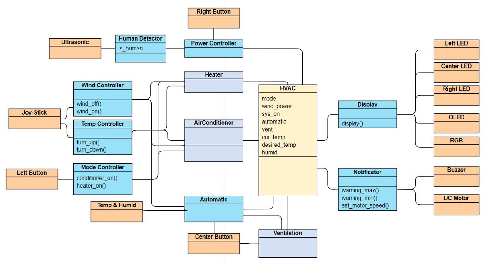

# project
차량용 공조기 MCU 펌웨어 개발 
공조기 기능 : 냉/난방, 자동/수동 온도 조절 모드, 외기/내기 순환 모드, 바람세기 및 희망온도 조절(최소 또는 최대 범위를 넘어갈 시 경고음 울림), 공조장치와 차량 내부 상태 표시, 근처에 사람이 없을 시 자동 꺼짐
  

# 사용된 하드웨어
- 보드 및 MCU : Cortext-M4-Keil platform, STM NUCLEO F401RE 
- 보드에 포함된 센서 및 액추에이터 : 스위치 3개, 단색 LED 3개, RGB LED 1개, 조이스틱 1개, 초음파 센서 1개, OLED 1개, 부저 1개, DC모터 1개  

# 하드웨어 사용 목적
- 단색 LED : 냉/난방 모드, 자동/수동 모드, 내기/외기 순환 모드 선택 표시, 전원 ON/OFF 선택 표시 
- RGB LED : 현재 모드 (냉방 - 파란색, 난방 - 빨간색) 및 전원 상태 (전원 꺼진 경우 초록색) 표시 
- 조이스틱 : 온도 및 풍속 조절 
- 초음파 센서 : 근처에 사람 유무 판단 
- OLED : 현재 상태 표시 (냉난방 모드, 희망 온도, 현재 온도, 습도, 바람세기) 
- 부저 : 바람 또는 온도를 최소, 최대 범위를 넘어가게 설정하려고 시도하는 경우 경고음 (바람 : 1에서 5, 온도 : 16도에서 32도) 
- DC 모터 : 풍속 표시 (풍속이 강하면 빠르게 회전), 냉난방 구분 (방향 반대)  

# 소프트웨어 설계

|이름|기능|
|----|----|
|Display|● 현재 상태의 변화를 디스플레이에 반영한다.|
|Heater|● 조이스틱의 동작으로부터 신호를 받아 목표 온도와 풍속을 설정하고, 설정 온도와 설정 풍속에 따라 DC모터를 동작시킨다. ● DC모터는 히터 모드일 때 반시계 방향으로 돌아가게 한다.|
|Vent|● 사용자의 스위치 입력 신호에 따라 vent를 열고 닫는다. ● auto 모드로 전환시 자동으로 vent를 닫는다.|
|Air Conditioner|● 조이스틱의 동작으로부터 신호를 받아 목표 온도와 풍속을 설정하고, 설정 온도와 설정 풍속에 따라 DC모터를 동작시킨다. ● DC 모터는 쿨러 모드일 때 시계 방향으로 돌아가게 한다.|
|Automatic Module|● 초기 사용자 설정 온도를 21도에서 23도로 설정하여 현재 온도와 차이에 따라 자동으로 풍속을 조절하게 한다. 온도 차이 10도 : 풍속 5단계 온도 차이 6도에서 10도 : 풍속 4단계 온도 차이 3도에서 6도 : 풍속 3단계 온도 차이 1~3도 : 풍속 2단계 그 외 : 풍속 1단계|
|Power Module|● 사용자의 오른쪽 스위치의 동작을 감지하여 시스템의 전원을 켜고 끈다. ● 초음파 센서를 통해 사람의 유무를 감지하여 일정 시간 이상 사람이 감지되지 않으면 전원을 끈다. ● 전원이 꺼져있다면 오른쪽 led의 불빛을 끄고, RGB센서의 Green 색상을 켠다. ● 전원이 켜져있다면 오른쪽 led의 불빛을 켜고, 현재 모드에 따라 냉방은 RGB센서의 Blue를, 난방은 Red를 켠다.|
|Alert Module|● 조이스틱의 입력으로 목표 온도와 풍속을 조절할 때, 최대 범위를 벗어나려고 하면 Buzzer를 통해 경고음을 낸다. ● 경고음은 최대값 이상으로 조작하면 높은 음, 최솟값 이하로 조작하면 낮은 음을 내게 한다.|

# 기타 자세한 내용은 hvac.pdf 참조